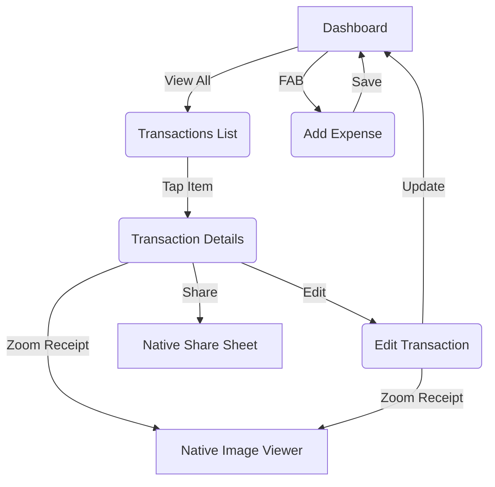

# Expense Tracker

A modern, responsive, and robust Android application designed to help users track their daily expenses, manage budgets, and maintain a clear overview of their financial health.

## 🚀 Features

* **Dashboard Overview:** Get an instant look at your Total Balance, total Income, total Spend, and your active Budget goal on a highly responsive, clean dashboard.
* **Hierarchical Transaction Ledger:** View all your logged expenses and incomes in a beautifully organized list, grouped logically by primary categories and sub-categories.
* **Expense Management:** Easily Add, Edit, or Delete transactions.
* **Smart Categorization & Accounts:** Keep your money organized by categorizing expenses and assigning them to specific accounts (Main Wallet, Credit Card, Savings, etc.).
* **Receipt Management:** Attach pictures of your receipts straight from your camera or photo gallery. The app automatically caches high-res images to internal storage.
* **Full-Screen Receipt Viewer:** Tap to zoom and pan through attached receipts seamlessly using a native image viewer.
* **Share Transactions:** Instantly generate a conversational summary of any transaction and share it via any messaging app.

## 🛠 Tech Stack & Architecture

This project is built using modern Android development practices and libraries:

* **Language:** Kotlin
* **Architecture:** MVVM (Model-View-ViewModel) + Clean Architecture principles
* **Local Persistence:** Room Database
* **Dependency Injection:** Dagger Hilt
* **UI Design:** XML Layouts with ViewBinding, utilizing `ConstraintLayout`, `FlexboxLayout`, and nested layouts for highly responsive screens.
* **Image Loading:** Picasso (for handling high-res gallery images and thumbnails efficiently)
* **File Provider:** Securely sharing internally cached receipts with external image viewers.

## 📱 Screenshots

  
  
  
  
  
  
  

## 📂 Screen Overview

This document provides a comprehensive overview of the screens within the Expense Tracker application. The app follows a modern MVVM + Clean Architecture pattern, with the UI layer organized by feature inside the presentation package.

### 1. Dashboard (`DashboardFragment`)
The primary landing screen of the application. It provides users with an immediate, high-level overview of their financial health.

**Key Components:**
* **Total Balance Card:** The central focal point displaying the user's current total balance.
* **Cash Flow Pills:** A responsive horizontal row that evenly divides the screen to display:
  * **Income:** Money flowing in (indicated by a downward arrow).
  * **Spend:** Money flowing out (indicated by an upward arrow).
  * **Budget:** The target budget limit (indicated by a piggy bank icon).
* **Recent Activity (Implied):** Typically displays a quick snapshot or chart of the most recent transactions to give context to the balance.

### 2. Transactions List (`TransactionsFragment`)
A comprehensive ledger of all user expenses and incomes.

**Key Components:**
* **Expandable Hierarchical List:** Uses a `RecyclerView` to group transactions. Data is structured to group items by primary categories (Mid) and sub-categories (Tid), allowing users to drill down into specific transaction types.
* **Transaction Items (`TransactionsAdapter`):** Displays the final leaf nodes (individual transactions) with their amount, date, and narration/notes.

### 3. Add Expense (`AddExpenseFragment`)
The data entry screen where users log new financial activities.

**Key Components:**
* **Amount Input:** Prominent input field for the transaction value.
* **Category & Account Selection:** Dropdown/selection fields to classify the expense (e.g., Dining, Utilities) and specify the funding source (e.g., Main Wallet, Credit Card).
* **Responsive Account Pills:** A horizontal selection of frequently used accounts (Main Wallet, Credit Card, Saving) that automatically scale to fit any screen size perfectly.
* **Date Picker:** Allows backdating or scheduling transactions.
* **Notes:** A multi-line text field for additional context.
* **Receipt Attachment:** Users can attach a receipt image either by taking a photo or picking an image from the gallery (using modern `PickVisualMedia` API with backward compatibility fallbacks). The image is safely copied to the app's internal storage for persistence.

### 4. Transaction Details (`TransactionDetail` Activity)
A read-only view providing an in-depth look at a specific, previously logged transaction.

**Key Components:**
* **Detail Readout:** Displays the exact amount, category, account, date, and notes of the transaction.
* **View Receipt (`zoomReceipt`):** If a receipt was attached during creation, the user can tap to launch a full-screen image viewer via Android's `FileProvider`.
* **Action Buttons:**
  * **Share:** Generates a conversational text snippet summarizing the transaction and opens the native Android share sheet.
  * **Edit:** Navigates the user to the Edit screen.
  * **Delete:** Prompts a confirmation dialog before permanently removing the transaction from the database.

### 5. Edit Transaction (`EditTransactionsActivity`)
The screen used to modify an existing transaction. It is heavily based on the `AddExpenseFragment` design but pre-populated with existing data.

**Key Components:**
* **Pre-filled Data:** On launch, the fields (Amount, Category, Notes, etc.) are populated with the existing transaction data.
* **Update Logic:** Validates the newly entered data and updates the record in the database using the `AddExpenseUseCase` (acting as an upsert/replace).
* **Receipt Viewer:** Inherits the same "View Receipt" functionality as the Details screen, allowing users to verify the attached receipt before making changes.

### User Flow Diagram

## 📝 License

This project is open-source. Feel free to use, modify, and distribute it!
